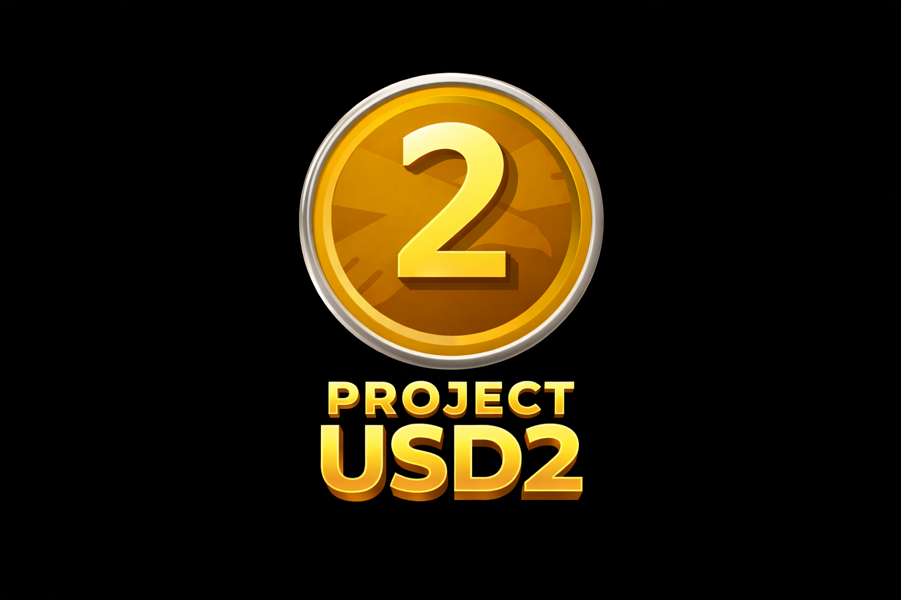

# USD2 Flywheel



## A Second-Order Value Recycling System Built on USD1

---

## Abstract

USD2 is a deterministic value recycling system derived from USD1 economic activity. It operates as a second-order layer that routes usage-generated value through a flywheel mechanism without interfacing with USD1 supply, custody, or governance. USD2 issuance is a function of measured USD1 activity rather than price or external market conditions. The system maintains strict invariants to ensure USD1 remains unaffected while creating a parallel accounting and execution layer for value recycling.

## Motivation

Second-order systems emerge when primary protocols generate externalities that can be captured and routed deterministically. USD1, as a stable base layer, produces economic activity that currently dissipates. USD2 provides infrastructure to measure this activity and route derived value through a flywheel without introducing dependencies or control surfaces on USD1 itself.

The need for USD2 arises from three observations:

1. USD1 activity generates measurable throughput that is not currently captured in any formal mechanism.
2. A second-order system can exist without modifying, wrapping, or governing the underlying asset.
3. Deterministic issuance models based on usage metrics provide stronger invariants than discretionary or price-based systems.

USD2 does not enhance USD1. It does not make USD1 better. It exists as separate infrastructure that depends on USD1 activity as an input signal.

## System Overview

USD2 consists of three primary components:

### USD1 Activity Monitor

A read-only observation layer that measures USD1 transaction volume, transfer frequency, and protocol interaction depth. This component does not interact with USD1 state or custody. It samples on-chain activity at defined intervals and produces aggregate metrics.

### Flywheel Router

A deterministic state machine that accepts activity metrics as input and calculates routing parameters. The router applies fixed formulas to determine how value flows through the system. It maintains no discretionary authority and executes only programmatic logic.

### USD2 Issuance Module

An execution layer that mints USD2 according to outputs from the flywheel router. Issuance occurs at defined epochs based on accumulated activity metrics. The module enforces supply constraints and issuance rate limits as defined in system parameters.

## Flywheel Mechanics

The flywheel operates in discrete cycles. Each cycle consists of the following steps:

1. **Activity Sampling**: The monitor aggregates USD1 activity over the epoch period. Metrics include total volume, unique addresses, and contract interactions.

2. **Metric Normalization**: Raw activity data is normalized against baseline parameters to produce a dimensionless activity coefficient.

3. **Routing Calculation**: The flywheel router applies the activity coefficient to determine the current recycling rate.

4. **Issuance Execution**: The issuance module mints USD2 according to the calculated rate, subject to maximum supply and rate limit constraints.

5. **State Transition**: The system transitions to the next epoch and resets activity accumulators.

No step involves randomness, external oracles, or discretionary input. The flywheel is a deterministic function of measured on-chain activity.

## Issuance Model

USD2 issuance follows a usage-based model where supply increases proportionally to USD1 activity within defined constraints.

### Variables

- `V_usd1`: Aggregate USD1 transaction volume in epoch `e`
- `A_usd1`: Number of unique active addresses using USD1 in epoch `e`
- `B`: Baseline activity threshold
- `R_max`: Maximum recycling rate
- `S_usd2`: Current USD2 supply
- `S_max`: Maximum USD2 supply cap
- `I_usd2`: USD2 issuance for epoch `e`

### Pseudocode

```
function calculate_issuance(V_usd1, A_usd1, B, R_max, S_usd2, S_max):
    # Calculate activity coefficient
    activity_coefficient = (V_usd1 * log(A_usd1 + 1)) / B
    
    # Bound coefficient to prevent overflow
    activity_coefficient = min(activity_coefficient, 10.0)
    
    # Calculate recycling rate
    recycling_rate = activity_coefficient * R_max
    
    # Calculate raw issuance
    raw_issuance = recycling_rate * V_usd1
    
    # Apply supply cap constraint
    remaining_supply = S_max - S_usd2
    I_usd2 = min(raw_issuance, remaining_supply)
    
    # Apply rate limit (maximum 5% of current supply per epoch)
    rate_limit = 0.05 * S_usd2
    I_usd2 = min(I_usd2, rate_limit)
    
    return I_usd2
```

### Issuance Properties

- Issuance approaches zero as USD1 activity approaches zero.
- Issuance is bounded by `S_max` and per-epoch rate limits.
- The relationship between activity and issuance is sublinear to prevent runaway growth.
- No issuance occurs if `S_usd2 >= S_max`.

## Constraints and Invariants

The system enforces the following invariants at all times:

### USD1 Stability Invariant

USD2 operations do not affect USD1 supply, price, or protocol behavior. The activity monitor is read-only. No USD1 tokens are locked, wrapped, or held in USD2 contracts.

### Non-Custodial Invariant

USD2 does not custody USD1 at any point. Users do not deposit USD1 to receive USD2. USD2 issuance is independent of individual USD1 holdings.

### Supply Constraint Invariant

Total USD2 supply cannot exceed `S_max`. Once this limit is reached, no further issuance occurs regardless of USD1 activity.

### Determinism Invariant

All state transitions are deterministic functions of on-chain data. No external input, governance vote, or manual intervention can alter issuance logic during operation.

## Threat Model

### Economic Attack Vectors

**Wash Trading**: Attackers generate artificial USD1 volume to manipulate issuance calculations.

*Mitigation*: Activity coefficient uses logarithmic scaling on address count, making Sybil attacks costly. High-frequency low-value transactions contribute minimally to aggregate metrics.

**Flash Loan Manipulation**: Attackers use flash loans to create temporary volume spikes.

*Mitigation*: Activity sampling occurs over epoch periods (e.g., 24 hours), smoothing instantaneous spikes. Single-block activity has negligible impact on epoch aggregates.

**Supply Shock**: Rapid USD2 issuance creates market instability.

*Mitigation*: Per-epoch rate limits prevent issuance from exceeding 5% of current supply. Maximum supply cap enforces terminal scarcity.

### Governance Minimization

USD2 minimizes governance surfaces. Parameters such as `B`, `R_max`, and `S_max` are set at deployment and cannot be modified. This eliminates discretionary control and parameter manipulation as attack vectors.

The system operates autonomously once deployed. No multisig, admin key, or governance token exists.

## Reference Architecture

USD2 uses a modular architecture separating concerns across three layers:

### Accounting Layer

Tracks USD2 supply, issuance history, and epoch state. Maintains a ledger of all issuance events and enforces supply invariants. Implemented as immutable contract logic.

### Execution Layer

Handles token minting, transfer logic, and standard token interface compliance. Interfaces with the accounting layer to receive issuance authorizations.

### Observation Layer

Monitors USD1 activity via on-chain event indexing and state queries. Outputs aggregate metrics to the accounting layer at epoch boundaries. Does not write to USD1 state.

These layers interact through well-defined interfaces with strict permission boundaries. The observation layer has read-only access to USD1 data. The accounting layer has write authority over issuance decisions. The execution layer has mint authority bounded by accounting layer outputs.

## Current Status

USD2 is in the specification phase. This document represents the reference design. No contracts are deployed. No tokens exist. No addresses have been generated.

Current work focuses on formalizing the activity measurement methodology and validating the issuance model against simulated USD1 activity data.

## Roadmap

### Phase 1: Specification Finalization

- Complete formal specification of activity metrics
- Define epoch parameters and rate limits
- Establish testing framework for issuance model

### Phase 2: Reference Implementation

- Implement accounting layer contracts
- Implement execution layer contracts
- Implement observation layer indexer
- Conduct internal security review

### Phase 3: Execution Layer Activation

- Deploy contracts to testnet
- Run multi-epoch simulations with live USD1 data
- Audit contract system
- Deploy to mainnet

No timeline is provided. Each phase completes when technical requirements are satisfied.

## Disclaimer

USD2 is an experimental system. It has not been audited. It may contain errors. The design may change during implementation. No guarantees are made regarding functionality, security, or economic outcomes.

This system is infrastructure. It is not an investment vehicle. It makes no promises regarding value, returns, or utility. USD2 exists as a technical exploration of second-order value recycling mechanisms.

Use at your own risk.